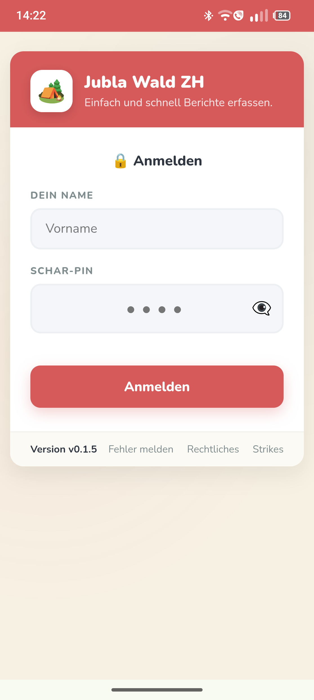
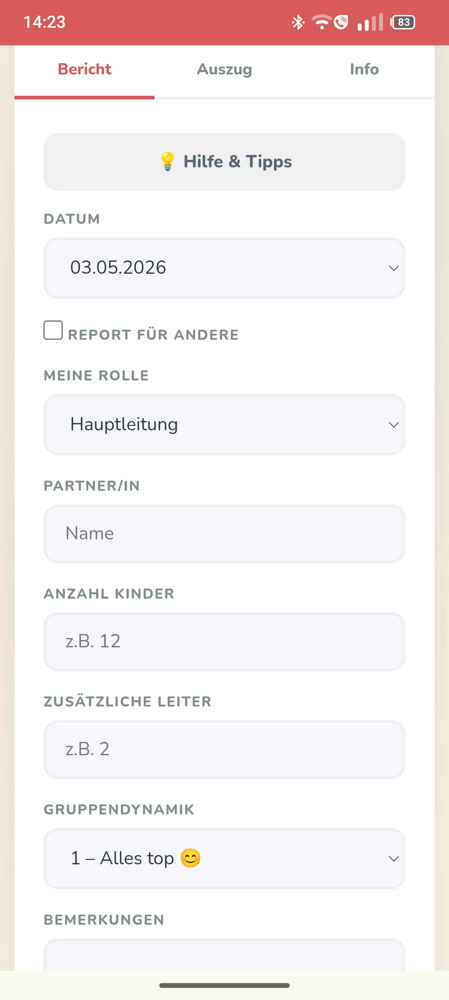
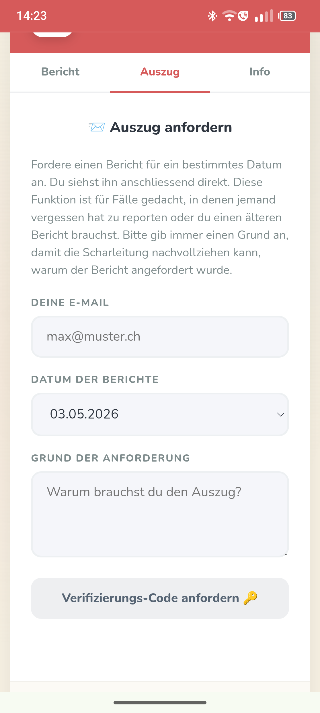
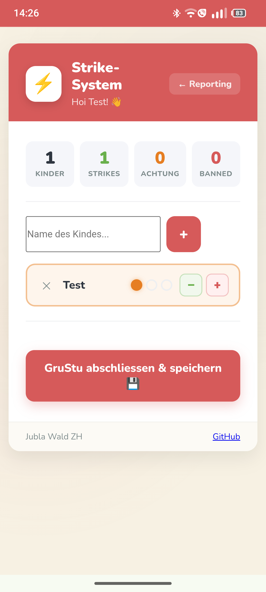

# ⚜️ Jubla Reporting Tool

> Das effiziente Tool zur Erfassung von Gruppenstunden-Berichten und zur Qualitätssicherung für Jubla-Scharen.

Dieses Tool ermöglicht es Leitenden, Berichte zu Gruppenstunden schnell und unkompliziert digital einzureichen. Die Daten landen direkt in einem Google Sheet, und die Scharleitung wird bei kritischen Vorfällen automatisch per Mail benachrichtigt.

---

## ✨ Features
*   🚀 **Einfaches Reporting:** Schlankes Frontend für schnelle Berichte nach der Gruppenstunde.
*   📊 **Google Sheets Integration:** Keine Datenbank-Administration nötig – alle Daten landen direkt in deiner Tabelle.
*   ⚠️ **Alarm-Funktion:** Automatische Benachrichtigung bei kritischen Situationen.
*   🎨 **Einfaches Branding:** Texte, Logos und Bezeichnungen lassen sich ohne Programmierkenntnisse anpassen.
*   ☁️ **Serverless:** Kostengünstiges Hosting via Netlify Functions.

## 📸 Screenshots

  
  
  
  

---

## 🛠 Setup & Installation

### Voraussetzungen
* Ein **Netlify** Account.
* Ein **Google Cloud Projekt** mit aktivierter Google Sheets API (für die Speicherung).

### Umgebungsvariablen (Environment)
Das Projekt nutzt Umgebungsvariablen für sensible Daten. Erstelle eine `.env` Datei lokal oder konfiguriere die Variablen direkt in Netlify:
* Siehe `.env.example` für alle benötigten Keys.

### Frontend-Anpassung
Du kannst das Tool für deine eigene Schar oder einen anderen Zweck umbenennen:
* Bearbeite die Datei `public/assets/js/config.js`.
* Hier lassen sich Branding-Optionen und öffentliche Texte anpassen, ohne die Logik zu verändern.

---

## Dokumentation

- [Google Sheets Setup (Spalten & Tabs)](docs/setup-sheets.md)
- [Branding & Anpassungen (config.js)](docs/branding.md)
- [Rechtliche Hinweise & Datenschutz](LEGAL.md)
- [Sicherheitsrichtlinie (Security Policy)](SECURITY.md)

---

## 🤝 Mitwirken (Contributing)

Für Fehlermeldungen und Verbesserungsvorschläge darfst du gerne ein Issue erstellen.
Wenn du willst, darfst du gerne auch deinen Code beitrage. Forke diesen Projekt, erstelle einen PR und lass ihn reviewen.

---

## 📜 Lizenz
Dieses Projekt steht unter der **GPL-3.0 License**. Du darfst es gerne für deine Schar verwenden, modifizieren und teilen.

---
*Entwickelt mit ❤️ für die Jubla.*